# BACKEND ARCHITECTURE - UML CLASS DIAGRAM

This file contains Mermaid diagrams for visualizing the backend codebase structure.

---

## 1. MODELS LAYER - Data Structures

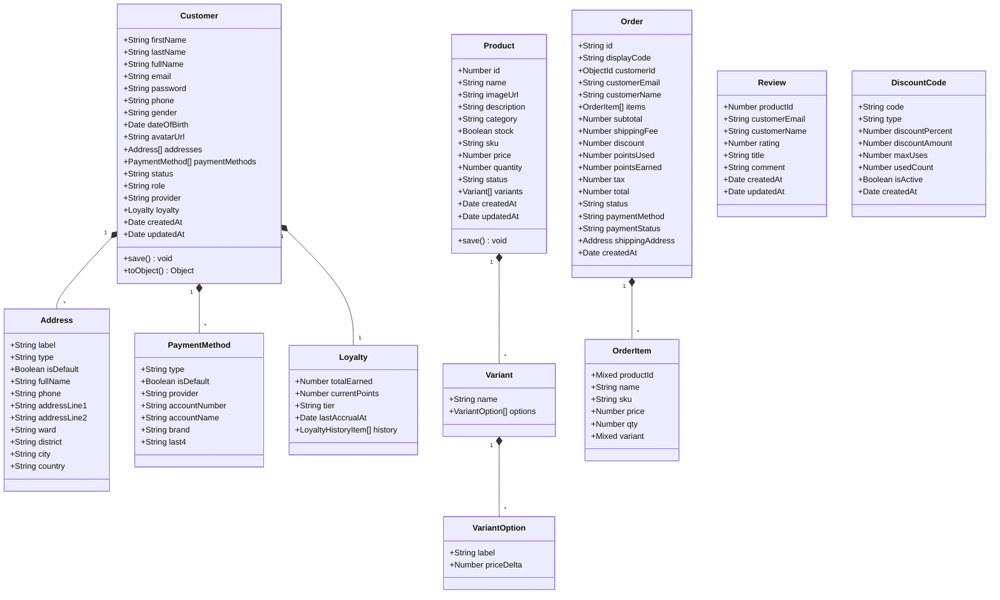

---

## 2. REPOSITORY & ADAPTER LAYER

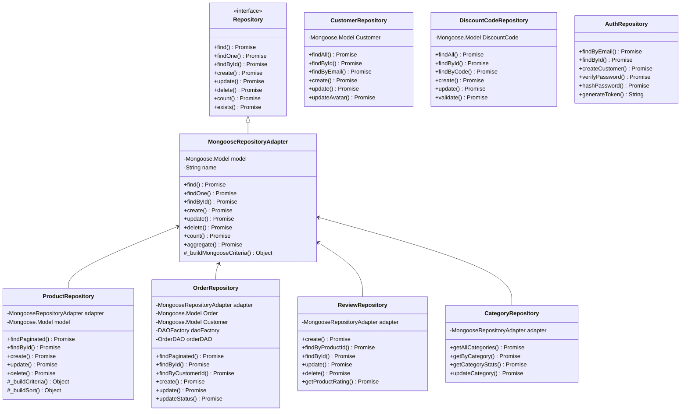

---

## 3. CONTROLLER & SERVICE LAYER

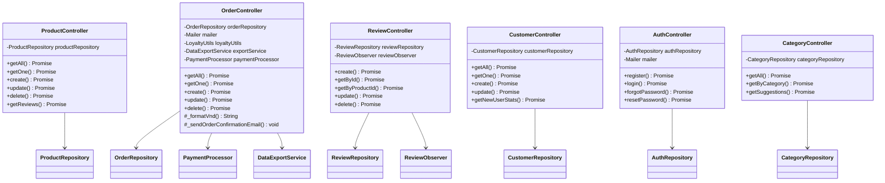

---

## 4. PATTERN IMPLEMENTATIONS - Singleton & Observer

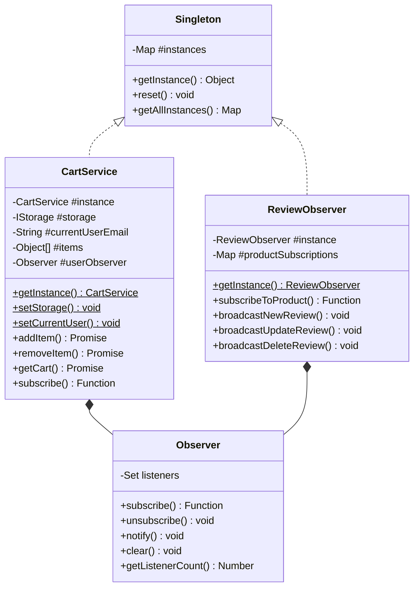

---

## 5. STRATEGY PATTERN - Payment Processing

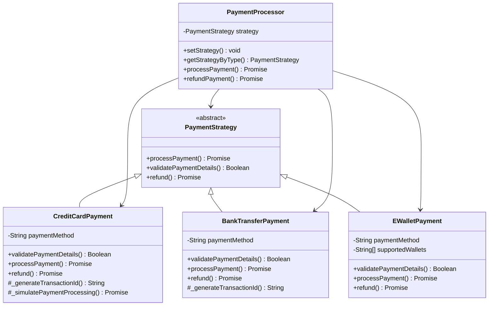

---

## 6. STRATEGY PATTERN - Data Export

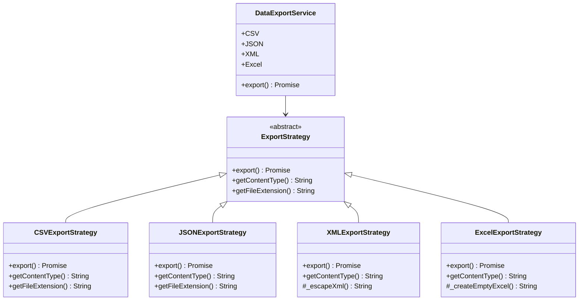

---

## 7. ADAPTER PATTERN - Storage & WebSocket

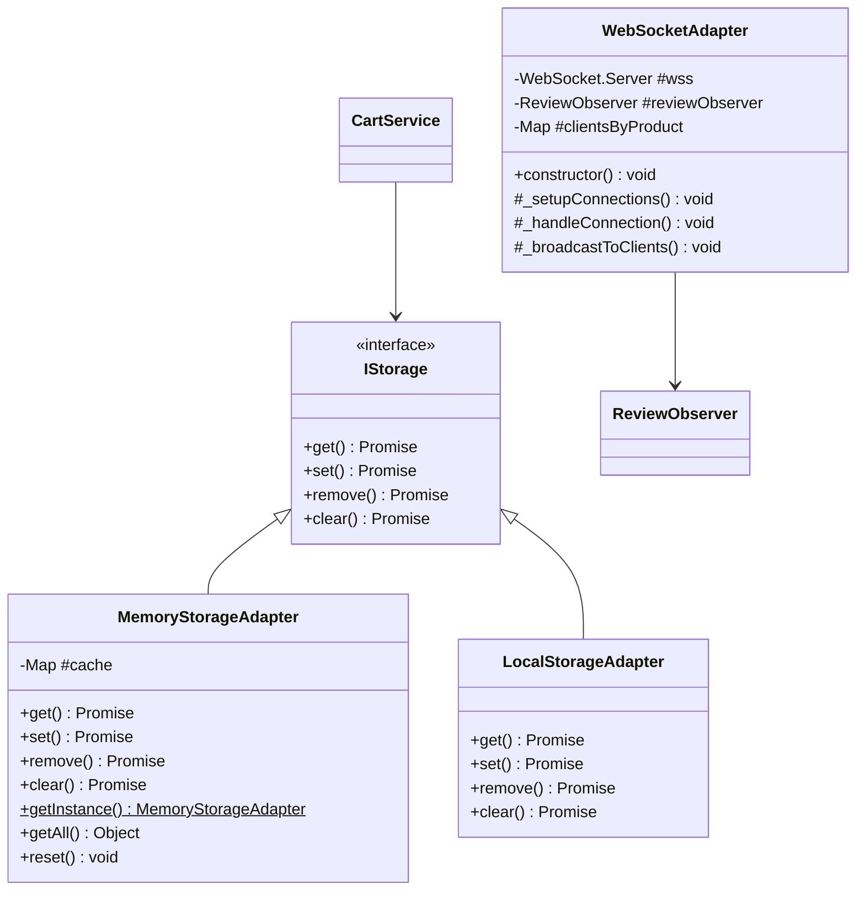

---

## 8. DAO PATTERN & CONNECTION POOLING

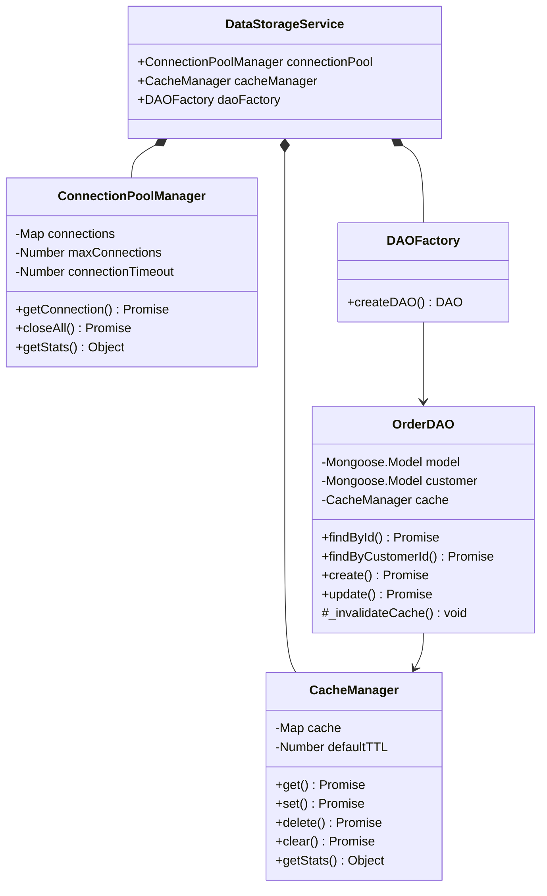

---

## 9. COMPLETE APPLICATION ARCHITECTURE - High Level

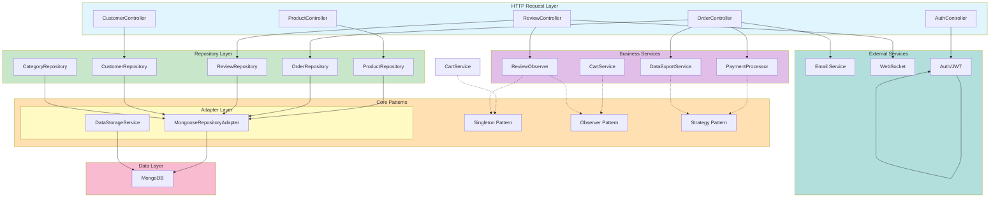

---

## 10. DEPENDENCY INJECTION FLOW

```mermaid
graph LR
    A["Application Start"]
    A --> DB["Connect to MongoDB"]
    DB --> MM["Load Mongoose Models"]
    MM --> RA["Create RepositoryAdapters"]
    RA --> R["Create Repositories"]
    R --> C["Create Controllers"]
    C --> S["Create Services"]
    S --> E["Register Express Routes"]
    E --> L["Start Listening"]

    style A fill:#fff9c4
    style DB fill:#f8bbd0
    style MM fill:#f8bbd0
    style RA fill:#fff9c4
    style R fill:#c8e6c9
    style C fill:#e1f5ff
    style S fill:#e1bee7
    style E fill:#b2dfdb
    style L fill:#c8e6c9
```

---

## 11. DATA FLOW - Order Creation

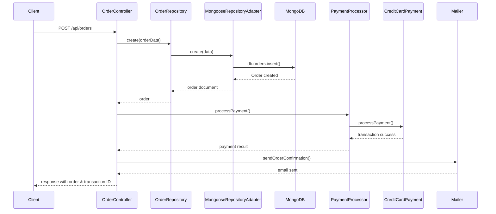

---

## 12. DATA FLOW - Review Broadcasting

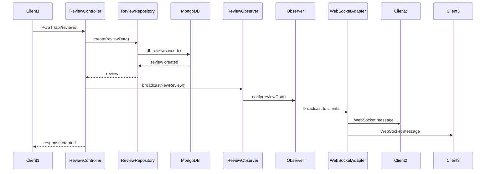

---

## 13. CACHING STRATEGY - Order DAO

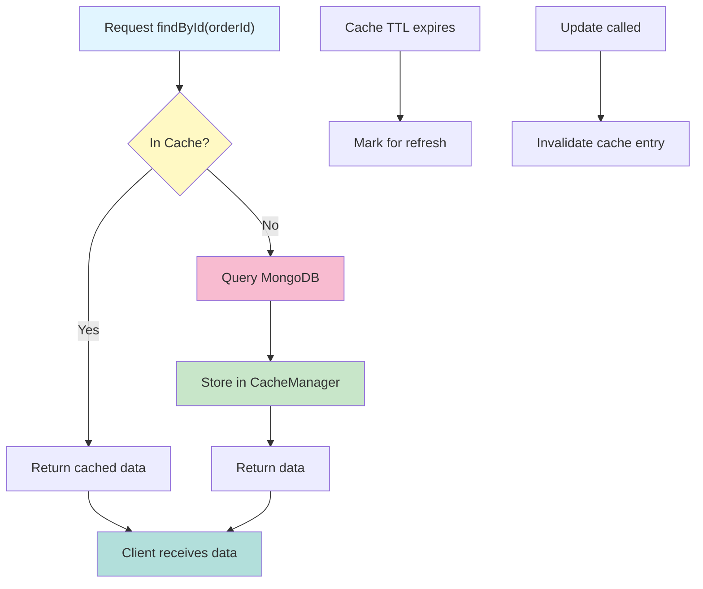

---

## 14. SERVICE INJECTION POINTS

```mermaid
graph TB
    subgraph Controllers["Controllers (HTTP)"]
        PC["ProductController<br/>+productRepository"]
        OC["OrderController<br/>+orderRepository<br/>+paymentProcessor<br/>+mailer"]
        RC["ReviewController<br/>+reviewRepository<br/>+reviewObserver"]
        CC["CustomerController<br/>+customerRepository"]
    end

    subgraph Repositories["Repositories (Data)"]
        PR["ProductRepository<br/>+adapter"]
        OR["OrderRepository<br/>+adapter<br/>+daoFactory"]
        RR["ReviewRepository<br/>+adapter"]
        CR["CustomerRepository"]
    end

    subgraph Services["Services (Business)"]
        PP["PaymentProcessor<br/>+strategy"]
        CS["CartService<br/>+storage"]
        RO["ReviewObserver<br/>+subscriptions"]
    end

    PC -->|inject| PR
    OC -->|inject| OR
    OC -->|inject| PP
    RC -->|inject| RR
    RC -->|inject| RO
    CC -->|inject| CR
    
    CS -->|inject via<br/>setStorage| "IStorage"
    
    style Controllers fill:#e1f5ff
    style Repositories fill:#c8e6c9
    style Services fill:#e1bee7
```

---

**All diagrams are ready for integration into UML design documents and architecture reviews.**
