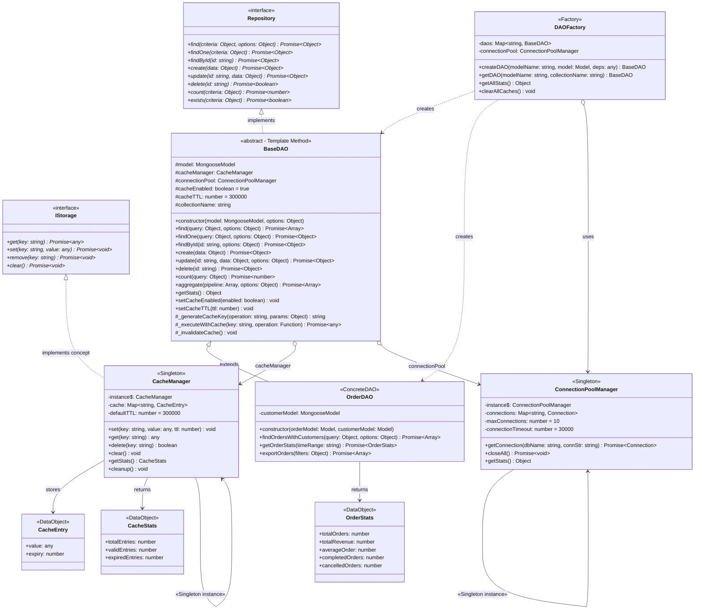
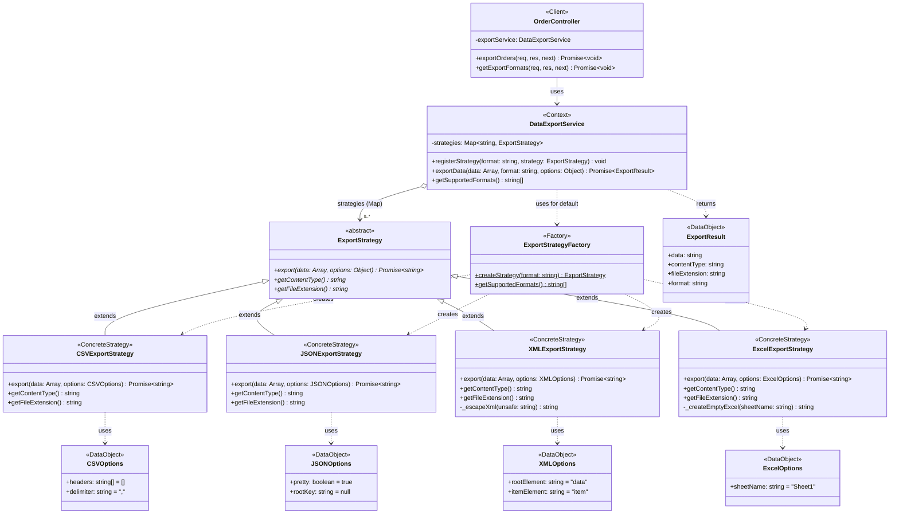

# Phân Tích Lưu Trữ Dữ Liệu & Xuất Dữ Liệu – E-Commerce Web Application

---

## 1. Lưu Trữ Dữ Liệu – DAO Pattern + Repository Pattern + Caching

### 1.1 Class Diagram



### 1.2 Giải thích các thành phần

| Thành phần | Loại class | Design Pattern | Vai trò |
|---|---|---|---|
| `IStorage` | **Interface** | — | Contract cho storage: `get/set/remove/clear` |
| `Repository` | **Interface** | Repository Pattern | Contract cho data access: `find/create/update/delete/count/exists` |
| `ConnectionPoolManager` | **Singleton** | Singleton | Quản lý pool kết nối MongoDB – max 10 connections, auto-cleanup |
| `CacheManager` | **Singleton** | Singleton | Quản lý cache Map với TTL – tự động cleanup entries hết hạn mỗi 5 phút |
| `BaseDAO` | **Abstract (Template Method)** | DAO + Template Method | Class cha cho mọi DAO – tích hợp caching tự động cho read operations, invalidate cache khi write |
| `OrderDAO` | **Concrete DAO** | DAO | Mở rộng BaseDAO cho đơn hàng – thêm `findOrdersWithCustomers`, `getOrderStats`, `exportOrders` |
| `DAOFactory` | **Factory** | Factory | Tạo DAO instance theo model name, cache DAO đã tạo |
| `CacheEntry` | **Data Object** | — | Cấu trúc entry trong cache: `{ value, expiry }` |
| `OrderStats` | **Data Object** | — | Kết quả thống kê đơn hàng |

### 1.3 Quan hệ giữa các class

| Quan hệ | Ký hiệu | Giải thích |
|---|---|---|
| `Repository <\|.. BaseDAO` | **Realization** | BaseDAO hiện thực tất cả method của Repository interface |
| `BaseDAO <\|-- OrderDAO` | **Inheritance** | OrderDAO kế thừa BaseDAO, thêm methods riêng cho đơn hàng |
| `BaseDAO o--> CacheManager` | **Aggregation** | BaseDAO chứa CacheManager – mỗi read operation đều kiểm tra cache trước |
| `BaseDAO o--> ConnectionPoolManager` | **Aggregation** | BaseDAO chứa connection pool manager |
| `DAOFactory ..> BaseDAO/OrderDAO` | **Dependency (creates)** | Factory tạo DAO tương ứng dựa trên `modelName` |
| `ConnectionPoolManager --> self` | **Self-reference (Singleton)** | Chỉ 1 instance pool tồn tại |
| `CacheManager --> self` | **Self-reference (Singleton)** | Chỉ 1 instance cache tồn tại |

### 1.4 Hiện thực

**Files:** `backend/services/DataStorageService.js`, `backend/core/interfaces/Repository.js`, `backend/core/interfaces/Storage.js`

```javascript
// ========== ConnectionPoolManager (Singleton) ==========
class ConnectionPoolManager {
  constructor() {
    if (ConnectionPoolManager.instance) return ConnectionPoolManager.instance;
    this.connections = new Map();
    this.maxConnections = 10;
    ConnectionPoolManager.instance = this;
  }

  async getConnection(dbName, connectionString) {
    if (this.connections.has(dbName)) return this.connections.get(dbName);
    if (this.connections.size >= this.maxConnections)
      throw new Error('Maximum connection pool size reached');
    const conn = await mongoose.createConnection(connectionString, { maxPoolSize: 10 });
    this.connections.set(dbName, conn);
    return conn;
  }
}

// ========== CacheManager (Singleton) ==========
class CacheManager {
  constructor() {
    if (CacheManager.instance) return CacheManager.instance;
    this.cache = new Map();
    this.defaultTTL = 300000; // 5 phút
    CacheManager.instance = this;
    setInterval(() => this.cleanup(), 300000); // auto-cleanup
  }

  set(key, value, ttl = this.defaultTTL) {
    this.cache.set(key, { value, expiry: Date.now() + ttl });
  }

  get(key) {
    const entry = this.cache.get(key);
    if (!entry || Date.now() > entry.expiry) { this.cache.delete(key); return null; }
    return entry.value;
  }
}

// ========== BaseDAO (Template Method) ==========
class BaseDAO {
  constructor(model, options = {}) {
    this.model = model;
    this.cacheManager = new CacheManager();      // Singleton
    this.connectionPool = new ConnectionPoolManager(); // Singleton
    this.cacheEnabled = options.cacheEnabled !== false;
    this.cacheTTL = options.cacheTTL || 300000;
  }

  // Template: đọc có cache
  async find(query = {}, options = {}) {
    const cacheKey = this._generateCacheKey('find', { query, options });
    return this._executeWithCache(cacheKey, () => this.model.find(query, null, options).lean());
  }

  // Template: ghi → invalidate cache
  async create(data) {
    const result = await this.model.create(data);
    this._invalidateCache();
    return result;
  }
}

// ========== OrderDAO (extends BaseDAO) ==========
class OrderDAO extends BaseDAO {
  constructor(orderModel, customerModel) {
    super(orderModel, { cacheEnabled: true, cacheTTL: 600000 });
    this.customerModel = customerModel;
  }

  async findOrdersWithCustomers(query = {}) {
    return this._executeWithCache(cacheKey, () =>
      this.model.find(query).populate('customerId', 'fullName email phone').lean()
    );
  }

  async getOrderStats(timeRange = 'all') {
    return this.model.aggregate([
      { $group: { _id: null, totalOrders: { $sum: 1 }, totalRevenue: { $sum: '$totalAmount' } } }
    ]);
  }
}

// ========== DAOFactory ==========
class DAOFactory {
  createDAO(modelName, model, ...deps) {
    switch (modelName) {
      case 'Order': return new OrderDAO(model, ...deps);
      default: return new BaseDAO(model);
    }
  }
}
```

---

## 2. Xuất Dữ Liệu – Strategy Pattern

### 2.1 Class Diagram



### 2.2 Giải thích các thành phần

| Thành phần | Loại class | Design Pattern | Vai trò |
|---|---|---|---|
| `DataExportService` | **Context** | Strategy | Quản lý strategies, delegate export cho strategy tương ứng |
| `ExportStrategyFactory` | **Factory** | Factory | Tạo strategy instance dựa trên format string |
| `ExportStrategy` | **Abstract Strategy** | Strategy | 3 method abstract: `export`, `getContentType`, `getFileExtension` |
| `CSVExportStrategy` | **Concrete Strategy** | Strategy | Xuất CSV – auto-detect headers, escape quotes, custom delimiter |
| `JSONExportStrategy` | **Concrete Strategy** | Strategy | Xuất JSON – hỗ trợ pretty print, optional root key |
| `XMLExportStrategy` | **Concrete Strategy** | Strategy | Xuất XML – escape đặc biệt `<>&'"`, custom root/item element |
| `ExcelExportStrategy` | **Concrete Strategy** | Strategy | Xuất Excel (TSV) – tab-separated values |
| `ExportResult` | **Data Object** | — | Kết quả export: data + contentType + fileExtension |
| `OrderController` | **Client** | — | Sử dụng `DataExportService` để export đơn hàng |

### 2.3 Quan hệ giữa các class

| Quan hệ | Ký hiệu | Giải thích |
|---|---|---|
| `ExportStrategy <\|-- ConcreteStrategies` | **Inheritance (extends)** | 4 concrete strategy kế thừa và override 3 method abstract |
| `DataExportService o--> ExportStrategy` | **Aggregation** | Context chứa Map strategies – có thể register thêm ở runtime |
| `DataExportService ..> ExportStrategyFactory` | **Dependency** | Nếu strategy chưa register → dùng Factory tạo default |
| `ExportStrategyFactory ..> ConcreteStrategies` | **Dependency (creates)** | Factory tạo strategy dựa trên format string |
| `OrderController --> DataExportService` | **Association (uses)** | Controller dùng service khi user yêu cầu export |

### 2.4 Hiện thực

**File:** `backend/services/DataExportService.js`

```javascript
// ========== ExportStrategy (Abstract) ==========
class ExportStrategy {
  async export(data, options = {}) { throw new Error('Must implement'); }
  getContentType() { throw new Error('Must implement'); }
  getFileExtension() { throw new Error('Must implement'); }
}

// ========== CSVExportStrategy ==========
class CSVExportStrategy extends ExportStrategy {
  async export(data, options = {}) {
    const { headers = [], delimiter = ',' } = options;
    const csvHeaders = headers.length > 0 ? headers : Object.keys(data[0]);
    const rows = data.map(item =>
      csvHeaders.map(h => {
        const v = String(item[h] || '');
        return v.includes(delimiter) || v.includes('"') ? `"${v.replace(/"/g, '""')}"` : v;
      })
    );
    return [csvHeaders.join(delimiter), ...rows.map(r => r.join(delimiter))].join('\n');
  }
  getContentType() { return 'text/csv'; }
  getFileExtension() { return 'csv'; }
}

// ========== JSONExportStrategy ==========
class JSONExportStrategy extends ExportStrategy {
  async export(data, options = {}) {
    const { pretty = true, rootKey = null } = options;
    const exportData = rootKey ? { [rootKey]: data } : data;
    return JSON.stringify(exportData, null, pretty ? 2 : 0);
  }
  getContentType() { return 'application/json'; }
  getFileExtension() { return 'json'; }
}

// ========== XMLExportStrategy ==========
class XMLExportStrategy extends ExportStrategy {
  async export(data, options = {}) {
    const { rootElement = 'data', itemElement = 'item' } = options;
    const items = data.map(item => {
      const props = Object.entries(item)
        .map(([k, v]) => `  <${k}>${this._escapeXml(String(v))}</${k}>`)
        .join('\n');
      return `  <${itemElement}>\n${props}\n  </${itemElement}>`;
    }).join('\n');
    return `<${rootElement}>\n${items}\n</${rootElement}>`;
  }
  _escapeXml(s) { return s.replace(/[<>&'"]/g, c => ({ '<':'&lt;', '>':'&gt;', '&':'&amp;' }[c] || c)); }
  getContentType() { return 'application/xml'; }
  getFileExtension() { return 'xml'; }
}

// ========== ExportStrategyFactory ==========
class ExportStrategyFactory {
  static createStrategy(format) {
    switch (format.toLowerCase()) {
      case 'csv': return new CSVExportStrategy();
      case 'json': return new JSONExportStrategy();
      case 'xml': return new XMLExportStrategy();
      case 'excel': return new ExcelExportStrategy();
      default: throw new Error(`Unsupported: ${format}`);
    }
  }
}

// ========== DataExportService (Context) ==========
class DataExportService {
  constructor() { this.strategies = new Map(); }

  registerStrategy(format, strategy) {
    this.strategies.set(format.toLowerCase(), strategy); // Mở rộng runtime
  }

  async exportData(data, format, options = {}) {
    const strategy = this.strategies.get(format) || ExportStrategyFactory.createStrategy(format);
    const exportedData = await strategy.export(data, options);
    return {
      data: exportedData,
      contentType: strategy.getContentType(),
      fileExtension: strategy.getFileExtension(),
      format: format.toLowerCase()
    };
  }
}
```

---

## Tổng hợp

| Module | Patterns sử dụng | Loại class chính | Files |
|---|---|---|---|
| **Lưu trữ dữ liệu** | DAO, Repository, Singleton, Factory, Template Method | `BaseDAO` (abstract), `OrderDAO` (concrete), `CacheManager` + `ConnectionPoolManager` (Singleton), `DAOFactory` (Factory) | `DataStorageService.js`, `Repository.js`, `Storage.js` |
| **Xuất dữ liệu** | Strategy, Factory | `ExportStrategy` (abstract), 4 concrete strategies, `ExportStrategyFactory` (Factory), `DataExportService` (Context) | `DataExportService.js` |
