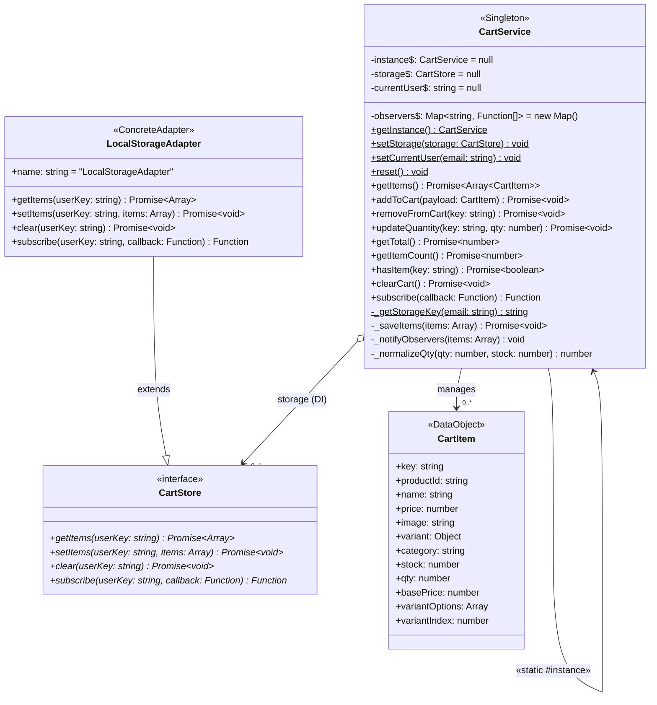
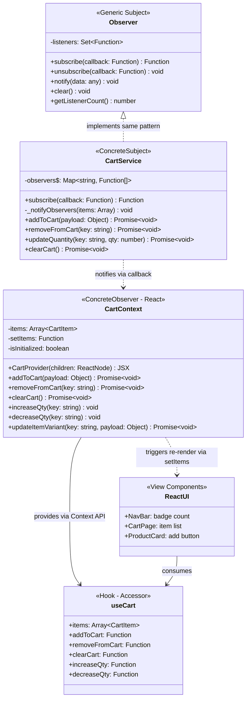
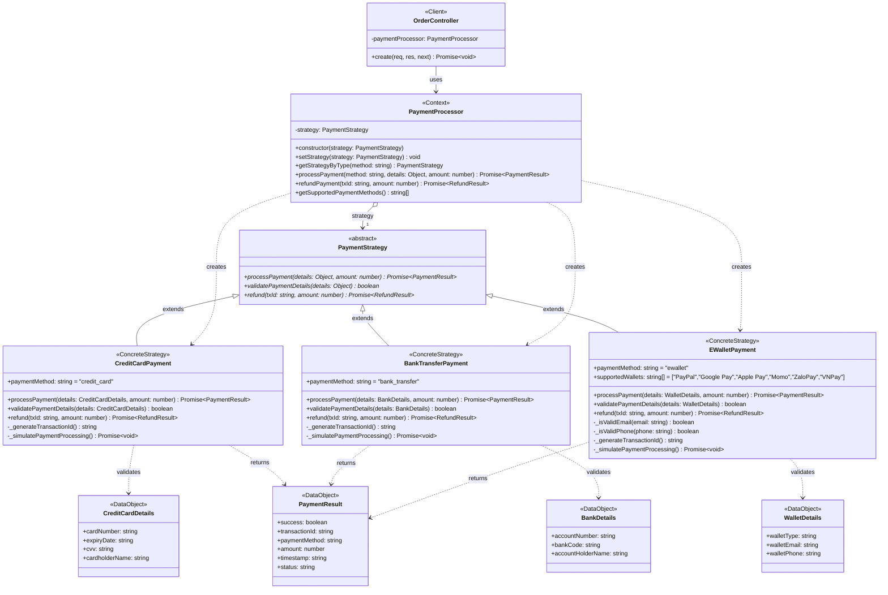

# Phân Tích 4 Design Patterns – E-Commerce Web Application

---

## 1. Factory Pattern – Tạo đối tượng sản phẩm

### 1.1 Class Diagram

```mermaid
classDiagram
    class ProductFactory {
        <<Creator>>
        +createProduct(type: string, payload: Object)$ Product
    }

    class Product {
        <<interface>>
        +category: string
        +name: string
        +price: number
        +stock: boolean
        +sku: string
        +description: string
        +variants: Array~Object~
    }

    class CoffeeProduct {
        <<ConcreteProduct>>
        +category: "coffee"
        +name: string = "Cà phê đặc biệt"
        +price: number = 50000
        +stock: boolean = true
        +sku: string = "COF-{timestamp}"
        +description: string = "Cà phê nguyên chất"
        +variants: Array~Object~ = []
    }

    class AccessoryProduct {
        <<ConcreteProduct>>
        +category: "accessory"
        +name: string = "Phụ kiện"
        +price: number = 150000
        +stock: boolean = true
        +sku: string = "ACC-{timestamp}"
        +description: string = "Phụ kiện đi kèm"
        +variants: Array~Object~ = []
    }

    class ComboProduct {
        <<ConcreteProduct>>
        +category: "combo"
        +name: string = "Combo"
        +price: number = 200000
        +stock: boolean = true
        +sku: string = "CMB-{timestamp}"
        +description: string = "Combo tiết kiệm"
        +variants: Array~Object~ = []
    }

    class GeneralProduct {
        <<ConcreteProduct>>
        +category: string = "general"
        +name: string = "Sản phẩm chung"
        +price: number = 100000
        +stock: boolean = true
        +sku: string = "PRD-{timestamp}"
        +description: string = ""
        +variants: Array~Object~ = []
    }

    Product <|.. CoffeeProduct : implements
    Product <|.. AccessoryProduct : implements
    Product <|.. ComboProduct : implements
    Product <|.. GeneralProduct : implements
    ProductFactory ..> Product : creates
    ProductFactory ..> CoffeeProduct : «type = coffee»
    ProductFactory ..> AccessoryProduct : «type = accessory»
    ProductFactory ..> ComboProduct : «type = combo»
    ProductFactory ..> GeneralProduct : «type = default»
```

### 1.2 Giải thích các thành phần

| Thành phần | Loại class | Vai trò |
|---|---|---|
| `ProductFactory` | **Creator** (Static Factory) | Chứa logic `switch/case` để quyết định tạo loại sản phẩm nào |
| `Product` | **Interface** (ngầm định) | Cấu trúc chung mà tất cả sản phẩm đều tuân theo |
| `CoffeeProduct` | **Concrete Product** | Sản phẩm cà phê – SKU prefix `COF-`, giá mặc định 50.000₫ |
| `AccessoryProduct` | **Concrete Product** | Phụ kiện – SKU prefix `ACC-`, giá mặc định 150.000₫ |
| `ComboProduct` | **Concrete Product** | Combo – SKU prefix `CMB-`, giá mặc định 200.000₫ |
| `GeneralProduct` | **Concrete Product** | Sản phẩm chung (fallback) – SKU prefix `PRD-` |

### 1.3 Quan hệ giữa các class

| Quan hệ | Ký hiệu | Giải thích |
|---|---|---|
| `ProductFactory ..> Product` | **Dependency (creates)** | Factory tạo ra các Product – quan hệ phụ thuộc, Factory biết Product nhưng Product không biết Factory |
| `Product <\|.. ConcreteProducts` | **Realization (implements)** | Các Concrete Product hiện thực cấu trúc của Product interface |

### 1.4 Hiện thực

**File:** `backend/services/ProductFactory.js`

```javascript
class ProductFactory {
  static createProduct(type, payload = {}) {
    switch (type) {
      case 'coffee':
        return {
          category: 'coffee',
          name: payload.name || 'Cà phê đặc biệt',
          price: payload.price || 50000,
          stock: payload.stock !== undefined ? payload.stock : true,
          sku: payload.sku || `COF-${Date.now()}`,
          description: payload.description || 'Cà phê nguyên chất',
          variants: payload.variants || [],
          ...payload,
        };
      case 'accessory':
        return { category: 'accessory', name: payload.name || 'Phụ kiện',
                 price: payload.price || 150000, sku: payload.sku || `ACC-${Date.now()}`, ...payload };
      case 'combo':
        return { category: 'combo', name: payload.name || 'Combo',
                 price: payload.price || 200000, sku: payload.sku || `CMB-${Date.now()}`, ...payload };
      default:
        return { category: payload.category || 'general', name: payload.name || 'Sản phẩm chung',
                 price: payload.price || 100000, sku: payload.sku || `PRD-${Date.now()}`, ...payload };
    }
  }
}
```

---

## 2. Singleton Pattern – Quản lý giỏ hàng

### 2.1 Class Diagram



### 2.2 Giải thích các thành phần

| Thành phần | Loại class | Vai trò |
|---|---|---|
| `CartService` | **Singleton** | Đảm bảo chỉ 1 instance qua `static #instance` + `getInstance()` |
| `CartStore` | **Interface (Abstract)** | Contract cho storage – tất cả method throw Error nếu không override |
| `LocalStorageAdapter` | **Concrete Adapter** | Hiện thực `CartStore` bằng `window.localStorage` |
| `CartItem` | **Data Object** | Cấu trúc dữ liệu của 1 item trong giỏ hàng |

### 2.3 Quan hệ giữa các class

| Quan hệ | Ký hiệu | Giải thích |
|---|---|---|
| `CartService o--> CartStore` | **Aggregation (DI)** | CartService chứa CartStore nhưng không tạo ra nó – inject từ bên ngoài qua `setStorage()` |
| `CartService --> CartService` | **Self-reference (Singleton)** | `static #instance` trỏ về chính mình |
| `LocalStorageAdapter --\|> CartStore` | **Inheritance (extends)** | Kế thừa và override tất cả method abstract |
| `CartService --> CartItem` | **Association (manages)** | Quản lý collection các CartItem |

### 2.4 Hiện thực

**Files:** `frontend/src/core/services/CartService.js`, `frontend/src/core/interfaces/CartStore.js`, `frontend/src/core/adapters/LocalStorageAdapter.js`

```javascript
// ========== CartService (Singleton) ==========
class CartService {
  static #instance = null;   // Private static – chỉ 1 instance
  static #storage = null;    // Storage adapter (DI)
  static #observers = new Map();

  static getInstance() {
    if (!CartService.#instance) {
      CartService.#instance = new CartService();
    }
    return CartService.#instance;  // Luôn trả cùng 1 object
  }

  static setStorage(storage) { CartService.#storage = storage; }
}

// ========== CartStore (Interface) ==========
class CartStore {
  async getItems(userKey) { throw new Error('Must implement'); }
  async setItems(userKey, items) { throw new Error('Must implement'); }
  async clear(userKey) { throw new Error('Must implement'); }
}

// ========== LocalStorageAdapter (Concrete) ==========
class LocalStorageAdapter extends CartStore {
  async getItems(userKey) {
    return JSON.parse(localStorage.getItem(userKey)) || [];
  }
  async setItems(userKey, items) {
    localStorage.setItem(userKey, JSON.stringify(items));
  }
}
```

---

## 3. Observer Pattern – Cập nhật giao diện giỏ hàng

### 3.1 Class Diagram



### 3.2 Giải thích các thành phần

| Thành phần | Loại class | Vai trò trong Observer |
|---|---|---|
| `Observer` | **Generic Subject** (thuần OOP) | Class backend – quản lý `Set` listeners, `subscribe/notify/unsubscribe` |
| `CartService` | **Concrete Subject** | Tích hợp Observer – khi cart thay đổi → `_notifyObservers()` |
| `CartContext` | **Concrete Observer** | Subscribe vào CartService – nhận callback → cập nhật React state |
| `useCart` | **Hook (accessor)** | Cung cấp dữ liệu giỏ hàng cho React components |
| `ReactUI` | **View** | Tự động re-render khi `items` thay đổi |

### 3.3 Quan hệ giữa các class

| Quan hệ | Ký hiệu | Giải thích |
|---|---|---|
| `Observer <\|.. CartService` | **Realization** | CartService hiện thực vai trò Subject (pub/sub) |
| `CartService ..> CartContext` | **Dependency (notifies)** | Thông báo qua callback – quan hệ lỏng (loose coupling) |
| `CartContext ..> ReactUI` | **Dependency (re-render)** | Trigger re-render qua `setItems()` |
| `CartContext --> useCart` | **Association (provides)** | Cung cấp data/methods qua React Context API |

### 3.4 Luồng hoạt động

```
User click "Thêm vào giỏ"
  → CartService.addToCart(payload)
    → _saveItems(items)          // lưu vào storage
    → _notifyObservers(items)    // gọi TẤT CẢ callback
      → CartContext callback: setItems(updatedItems)
        → React state change
          → NavBar badge cập nhật số lượng
          → CartPage re-render danh sách mới
```

### 3.5 Hiện thực

**Files:** `backend/core/patterns/Observer.js`, `frontend/src/core/services/CartService.js`, `frontend/src/contexts/CartContext.jsx`

```javascript
// ========== Observer.js (Generic – backend) ==========
class Observer {
  constructor() { this.listeners = new Set(); }

  subscribe(callback) {
    this.listeners.add(callback);
    return () => this.unsubscribe(callback);
  }

  notify(data) {
    for (const listener of this.listeners) {
      try { listener(data); }
      catch (error) { console.error('Observer error:', error); }
    }
  }
}

// ========== CartService – Subject (frontend) ==========
class CartService {
  static #observers = new Map();

  subscribe(callback) {
    const userKey = CartService._getStorageKey();
    CartService.#observers.get(userKey).push(callback);
    return () => { /* unsubscribe */ };
  }

  _notifyObservers(items) {
    const callbacks = CartService.#observers.get(userKey) || [];
    callbacks.forEach((cb) => cb(items));
  }

  async addToCart(payload) {
    await this._saveItems(items);
    this._notifyObservers(items);  // ← TRIGGER
  }
}

// ========== CartContext.jsx – Observer (React) ==========
const CartProvider = ({ children }) => {
  const [items, setItems] = useState([]);

  useEffect(() => {
    const unsubscribe = cartService.subscribe((updatedItems) => {
      setItems(updatedItems);  // ← UI RE-RENDER
    });
    return unsubscribe;
  }, [currentUserEmail]);
};
```

---

## 4. Strategy Pattern – Quản lý phương thức thanh toán

### 4.1 Class Diagram



### 4.2 Giải thích các thành phần

| Thành phần | Loại class | Vai trò |
|---|---|---|
| `PaymentProcessor` | **Context** | Nắm giữ reference tới strategy, delegate thanh toán |
| `PaymentStrategy` | **Abstract Strategy** | 3 method abstract: `processPayment`, `validatePaymentDetails`, `refund` |
| `CreditCardPayment` | **Concrete Strategy** | Thẻ tín dụng – validate card (≥13 digits), expiry (MM/YY), CVV (3-4 digits) |
| `BankTransferPayment` | **Concrete Strategy** | Chuyển khoản – validate account (≥8 digits), bank code |
| `EWalletPayment` | **Concrete Strategy** | Ví điện tử – hỗ trợ PayPal, Momo, ZaloPay, VNPay... |
| `OrderController` | **Client** | Sử dụng `PaymentProcessor` khi tạo đơn hàng |

### 4.3 Quan hệ giữa các class

| Quan hệ | Ký hiệu | Giải thích |
|---|---|---|
| `PaymentStrategy <\|-- ConcreteStrategies` | **Inheritance (extends)** | 3 concrete strategy kế thừa và override method abstract |
| `PaymentProcessor o--> PaymentStrategy` | **Aggregation** | Context chứa 1 strategy – thay đổi runtime qua `setStrategy()` |
| `PaymentProcessor ..> ConcreteStrategies` | **Dependency (creates)** | Tạo strategy qua `getStrategyByType()` |
| `OrderController --> PaymentProcessor` | **Association (uses)** | Controller dùng Processor khi tạo đơn |

### 4.4 Hiện thực

**Files:** `backend/strategies/PaymentStrategy.js`, `CreditCardPayment.js`, `BankTransferPayment.js`, `EWalletPayment.js`, `PaymentProcessor.js`

```javascript
// ========== PaymentStrategy (Abstract) ==========
class PaymentStrategy {
  async processPayment(details, amount) { throw new Error('Must implement'); }
  validatePaymentDetails(details) { throw new Error('Must implement'); }
  async refund(txId, amount) { throw new Error('Must implement'); }
}

// ========== CreditCardPayment (Concrete) ==========
class CreditCardPayment extends PaymentStrategy {
  constructor() { super(); this.paymentMethod = 'credit_card'; }

  validatePaymentDetails({ cardNumber, expiryDate, cvv, cardholderName }) {
    if (!cardNumber || cardNumber.replace(/\s/g, '').length < 13)
      throw new Error('Card number is invalid');
    if (!/^\d{2}\/\d{2}$/.test(expiryDate))
      throw new Error('Expiry date must be MM/YY');
    if (!/^\d{3,4}$/.test(cvv))
      throw new Error('CVV is invalid');
    return true;
  }

  async processPayment(details, amount) {
    this.validatePaymentDetails(details);
    await this._simulatePaymentProcessing();
    return { success: true, transactionId: `CC_${Date.now()}`, amount, status: 'completed' };
  }
}

// ========== PaymentProcessor (Context) ==========
class PaymentProcessor {
  constructor(strategy = null) { this.strategy = strategy; }

  getStrategyByType(method) {
    switch (method) {
      case 'credit_card': return new CreditCardPayment();
      case 'bank_transfer': return new BankTransferPayment();
      case 'ewallet': return new EWalletPayment();
      default: throw new Error(`Unknown: ${method}`);
    }
  }

  async processPayment(method, details, amount) {
    const strategy = this.getStrategyByType(method);
    this.setStrategy(strategy);
    return await this.strategy.processPayment(details, amount);
  }
}
```

---

## Tổng hợp

| Pattern | Loại class chính | Quan hệ cốt lõi | Files |
|---|---|---|---|
| **Factory** | Creator → Concrete Products | Dependency (creates) | `ProductFactory.js` |
| **Singleton** | Singleton + Interface + Adapter | Self-reference, Aggregation (DI), Inheritance | `CartService.js`, `CartStore.js`, `LocalStorageAdapter.js` |
| **Observer** | Subject → Observer | Dependency (notifies), loose coupling | `Observer.js`, `CartService.js`, `CartContext.jsx` |
| **Strategy** | Context → Abstract → Concrete | Aggregation, Inheritance, Dependency | `PaymentStrategy.js`, 3 strategies, `PaymentProcessor.js` |
