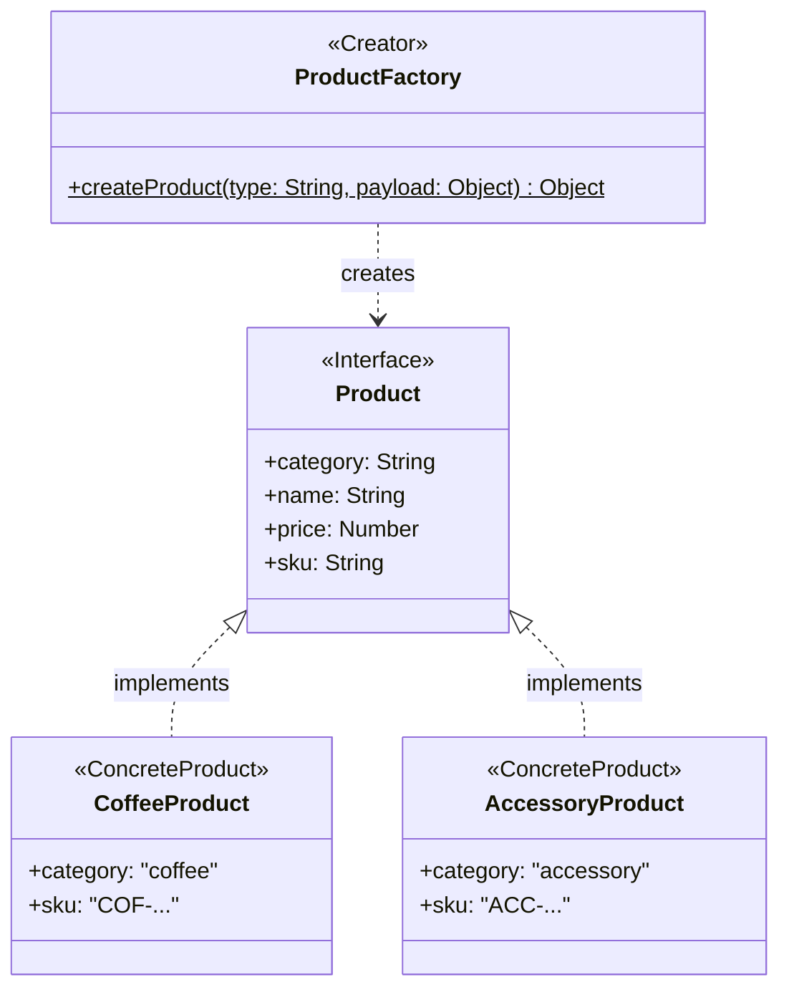
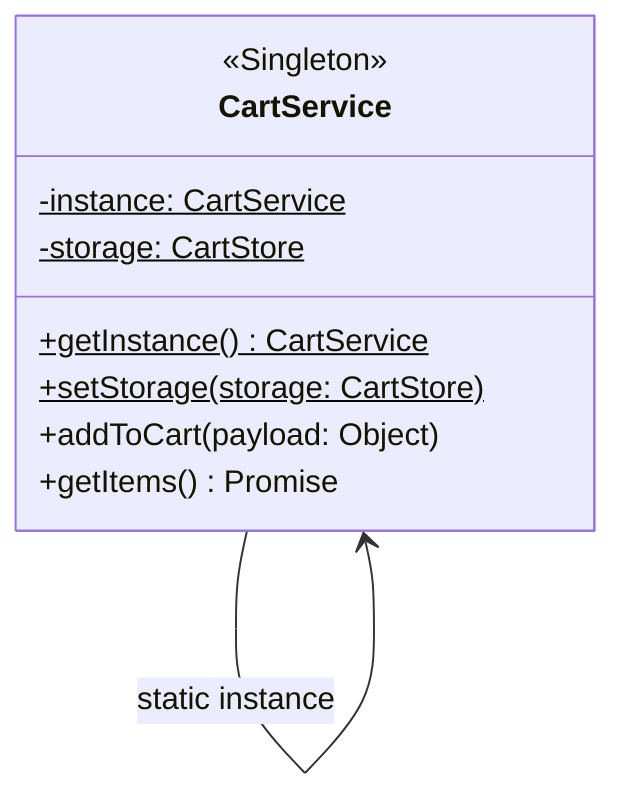
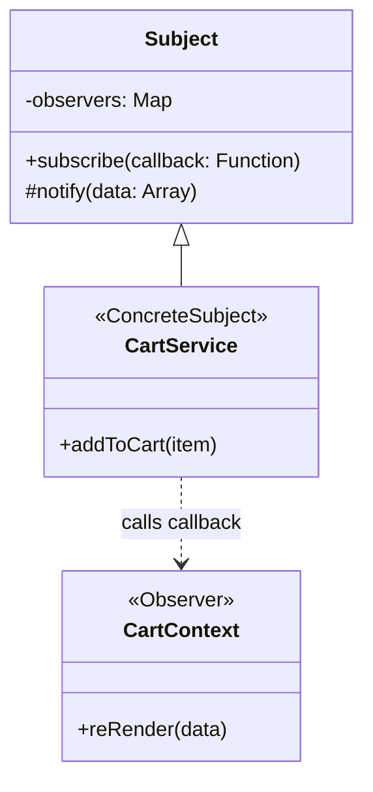
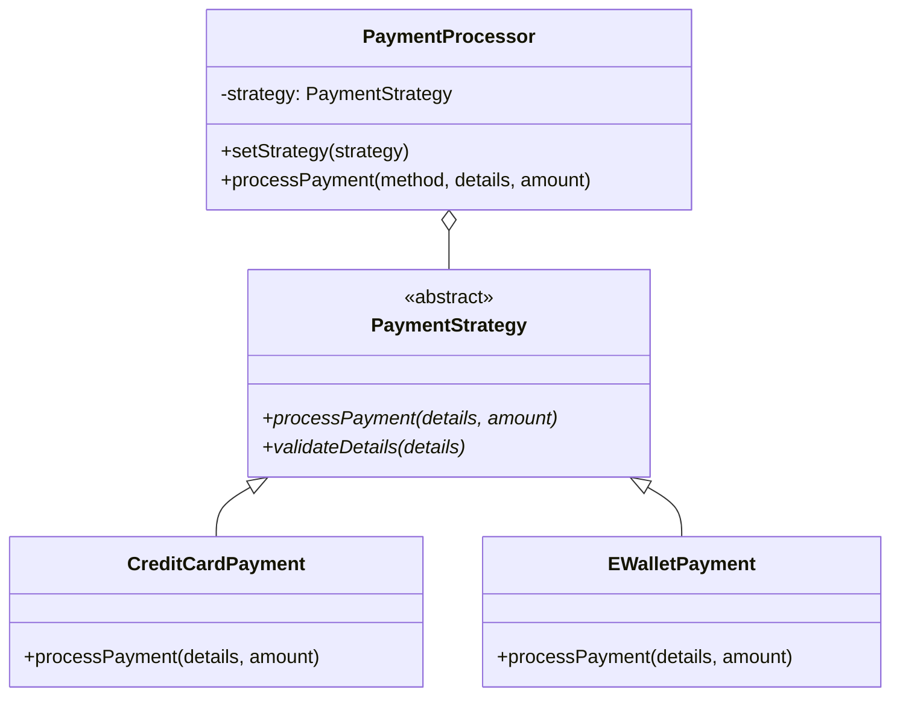
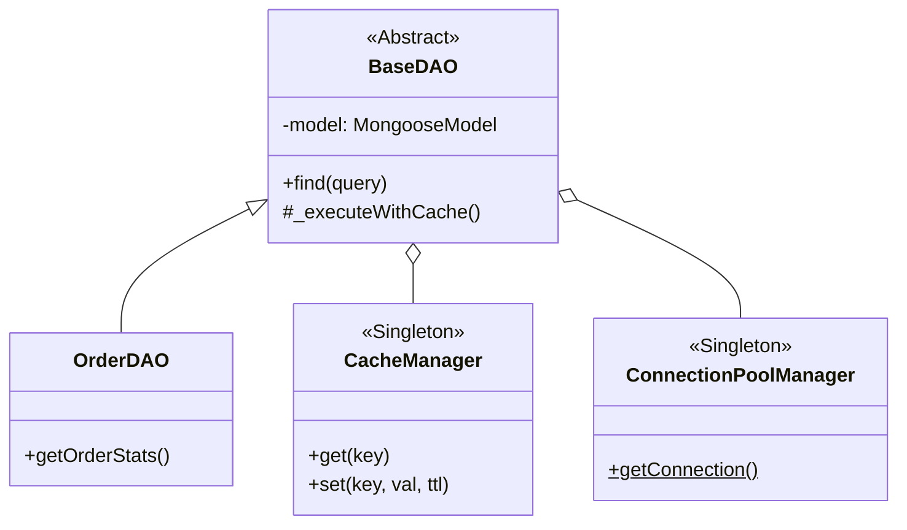

# Tài Liệu Phân Tích Design Patterns – E-Commerce Web Application

Tài liệu này phân tích chi tiết 6 mẫu thiết kế (Design Patterns) chủ đạo được áp dụng trong hệ thống, bao gồm cách sử dụng, vị trí file, cấu trúc Class, các phương thức, thuộc tính và mối quan hệ để phục vụ việc vẽ Class Diagram và hiện thực mã nguồn.

---

## 1. Factory Pattern – Tạo đối tượng sản phẩm

### 1.1 Phân tích & Vị trí
Trong hệ thống E-Commerce, sản phẩm có nhiều loại khác nhau (Cà phê, Phụ kiện, Combo). Mỗi loại có các thuộc tính mặc định, tiền tố SKU và logic khởi tạo riêng. Factory Pattern giúp tách biệt logic khởi tạo đối tượng khỏi client, cho phép dễ dàng mở rộng các loại sản phẩm mới mà không cần sửa đổi mã nguồn ở nhiều nơi.

*   **Vị trí:** `backend/services/ProductFactory.js`

### 1.2 Bảng Cấu Trúc Class
| Role | Tên Class/Object | Ý nghĩa |
|---|---|---|
| **Creator** | `ProductFactory` | Class chứa logic `static` để quyết định loại sản phẩm nào sẽ được tạo dựa trên tham số `type`. |
| **Product Interface** | `Product` | Cấu trúc dữ liệu chung (ngầm định) mà mọi đối tượng sản phẩm phải tuân thủ. |
| **Concrete Product** | `CoffeeProduct` | Đối tượng sản phẩm loại Cà phê (SKU: COF-). |
| **Concrete Product** | `AccessoryProduct` | Đối tượng sản phẩm loại Phụ kiện (SKU: ACC-). |
| **Concrete Product** | `ComboProduct` | Đối tượng sản phẩm loại Combo (SKU: CMB-). |

### 1.3 Phương thức & Thuộc tính
| Class | Thành phần | Mô tả |
|---|---|---|
| `ProductFactory` | `createProduct(type, payload)` | Phương thức `static` nhận loại sản phẩm và dữ liệu đầu vào để trả về một `Product` object tương ứng. |
| `Product` | `category`, `name`, `price`, `sku`, `stock` | Các thuộc tính cơ bản mà mọi sản phẩm đều có. |

### 1.4 Mối Quan Hệ
| Mối quan hệ | Ký hiệu | Giải thích |
|---|---|---|
| **Dependency (creates)** | `ProductFactory ..> Product` | Factory tạo ra các thực thể của `Product`, Factory biết Product nhưng Product không biết Factory. |
| **Realization** | `Product <|.. ConcreteProducts` | Các loại sản phẩm cụ thể (Coffee, Accessory, etc.) hiện thực các đặc tính của Product. |

### 1.5 Class Diagram (Sơ đồ lớp)


### 1.6 Hiện Thực Mẫu
```javascript
class ProductFactory {
  static createProduct(type, payload = {}) {
    switch (type) {
      case 'coffee':
        return {
          category: 'coffee',
          sku: payload.sku || `COF-${Date.now()}`,
          price: payload.price || 50000,
          ...payload
        };
      case 'accessory':
        return {
          category: 'accessory',
          sku: payload.sku || `ACC-${Date.now()}`,
          ...payload
        };
      default:
        return { category: 'general', ...payload };
    }
  }
}
```

---

## 2. Singleton Pattern – Quản lý giỏ hàng

### 2.1 Phân tích & Vị trí
Giỏ hàng cần được quản lý tập trung để đảm bảo tính đồng nhất dữ liệu trên toàn ứng dụng. Singleton Pattern đảm bảo chỉ có một instance duy nhất của `CartService` tồn tại trong suốt phiên làm việc, tránh việc tạo nhiều bản sao gây sai lệch số lượng sản phẩm giữa các trang.

*   **Vị trí:** `frontend/src/core/services/CartService.js`

### 2.2 Bảng Cấu Trúc Class
| Role | Tên Class | Ý nghĩa |
|---|---|---|
| **Singleton** | `CartService` | Quản lý logic giỏ hàng, lưu trữ instance duy nhất trong biến private static `#instance`. |
| **Adapter (Storage)** | `CartStore` | Interface cho việc lưu trữ (LocalStorageAdapter), được inject vào CartService. |

### 2.3 Phương thức & Thuộc tính
| Class | Thành phần | Mô tả | Kiểu dữ liệu |
|---|---|---|---|
| `CartService` | `#instance` | Biến static private lưu trữ instance duy nhất. | `CartService` |
| `CartService` | `getInstance()` | Phương thức static công khai để lấy instance duy nhất. | `CartService` |
| `CartService` | `addToCart(item)` | Thêm sản phẩm vào giỏ hàng duy nhất này. | `Promise<void>` |
| `CartService` | `getItems()` | Lấy danh sách item từ storage của instance. | `Promise<Array>` |

### 2.4 Mối Quan Hệ
| Mối quan hệ | Ký hiệu | Giải thích |
|---|---|---|
| **Self-reference** | `CartService --> CartService` | `CartService` giữ tham chiếu đến chính nó qua `#instance`. |
| **Aggregation (DI)** | `CartService o--> CartStore` | `CartService` chứa một `CartStore` được tiêm (inject) từ ngoài vào. |

### 2.5 Class Diagram (Sơ đồ lớp)


### 2.6 Hiện Thực Mẫu
```javascript
class CartService {
  static #instance = null;
  static #storage = null;

  static getInstance() {
    if (!CartService.#instance) {
      CartService.#instance = new CartService();
    }
    return CartService.#instance;
  }
  
  static setStorage(storage) { CartService.#storage = storage; }
}
```

---

## 3. Observer Pattern – Cập nhật giao diện giỏ hàng

### 3.1 Phân tích & Vị trí
Khi giỏ hàng thay đổi (thêm/xóa/sửa), các thành phần giao diện (UI) như Badge trên Navbar hay trang Cart Page cần cập nhật ngay. Observer Pattern giúp `CartService` thông báo cho các Subscriber (Context/UI) mà không cần can thiệp sâu vào code giao diện.

*   **Vị trí:** `backend/core/patterns/Observer.js` (Lớp cơ sở) và `frontend/src/contexts/CartContext.jsx`.

### 3.2 Bảng Cấu Trúc Class
| Role | Tên Class/Component | Ý nghĩa |
|---|---|---|
| **Subject (Observable)** | `CartService` | Nơi quản lý dữ liệu gốc và danh sách các hàm callback (observers). |
| **Concrete Observer** | `CartContext` | Đăng ký lắng nghe sự thay đổi từ `CartService` để cập nhật React state. |
| **Subscriber UI** | `NavBar / CartPage` | Các React component hiển thị dữ liệu mới khi state thay đổi. |

### 3.3 Phương thức & Thuộc tính
| Class | Thành phần | Mô tả |
|---|---|---|
| `CartService` | `subscribe(callback)` | Cho phép UI đăng ký hàm cập nhật vào danh sách thông báo. |
| `CartService` | `_notifyObservers(data)` | Duyệt qua danh sách các callbacks khi có thay đổi để thực thi chúng. |
| `CartContext` | `setItems(items)` | Hàm cập nhật state trong React, gây ra việc render lại toàn bộ UI liên quan. |

### 3.4 Mối Quan Hệ
| Mối quan hệ | Ý nghĩa |
|---|---|
| **Loose Coupling** | `CartService` không biết về React UI, nó chỉ giữ các hàm callback ẩn danh. |

### 3.5 Class Diagram (Sơ đồ lớp)


---

## 4. Strategy Pattern – Quản lý phương thức thanh toán

### 4.1 Phân tích & Vị trí
Sản phẩm hỗ trợ 3 loại thanh toán: Thẻ tín dụng, Chuyển khoản, Ví điện tử. Mỗi loại có quy định kiểm tra dữ liệu và API xử lý khác nhau. Strategy Pattern cho phép Controller thay đổi thuật toán xử lý linh hoạt tùy vào lựa chọn của người dùng.

*   **Vị trí:** `backend/strategies/` và `backend/strategies/PaymentProcessor.js`.

### 4.2 Bảng Cấu Trúc Class
| Role | Tên Class | Ý nghĩa |
|---|---|---|
| **Strategy (Abstract)** | `PaymentStrategy` | Lớp trừu tượng (hoặc interface) định nghĩa các methods chung. |
| **Concrete Strategy** | `CreditCardPayment` | Xử lý thanh toán thẻ (xác thực số thẻ, expiry, CVV). |
| **Concrete Strategy** | `BankTransferPayment` | Xử lý thanh toán chuyển khoản ngân hàng. |
| **Concrete Strategy** | `EWalletPayment` | Xử lý thanh toán ví điện tử (PayPal, Momo...). |
| **Context** | `PaymentProcessor` | Lớp trung gian giữ strategy hiện tại và thực thi các method delegate. |

### 4.3 Phương thức & Thuộc tính
| Class | Thành phần | Mô tả |
|---|---|---|
| `PaymentStrategy` | `processPayment(details, amount)` | Method trừu tượng phải được các lớp con hiện thực. |
| `PaymentProcessor` | `setStrategy(strategy)` | Giúp thay đổi thuật toán thanh toán tại thời điểm chạy (runtime). |

### 4.4 Class Diagram (Sơ đồ lớp)


---

## 5. Repository & DAO Pattern – Lưu trữ dữ liệu

### 5.1 Phân tích & Vị trí
Đây là tầng hạ tầng quản lý Database. DAO (Data Access Object) xử lý các câu lệnh SQL/Mongoose. Repository bọc lấy DAO để cung cấp một API mức cao cho Controller. Hệ thống còn áp dụng **Singleton** để quản lý Connection Pool và Cache bộ nhớ.

*   **Vị trí:** `backend/services/DataStorageService.js` và các file trong `backend/repositories/`.

### 5.2 Bảng Cấu Trúc Class
| Role | Tên Class | Ý nghĩa |
|---|---|---|
| **Template Class** | `BaseDAO` | Chứa các logic CRUD dùng chung và tích hợp Caching tự động. |
| **Concrete Class** | `OrderDAO / ProductDAO` | Mở rộng BaseDAO để xử lý logic riêng cho từng bảng. |
| **Singleton Pool** | `ConnectionPoolManager` | Đảm bảo duy trì và tái sử dụng tối đa 10 kết nối MongoDB. |
| **Singleton Cache** | `CacheManager` | Quản lý bộ phận lưu trữ đệm trong RAM với cơ chế hết hạn (TTL). |
| **Factory DAO** | `DAOFactory` | Chịu trách nhiệm tạo ra các instance DAO đúng loại từ Model Name. |

### 5.3 Mối Quan Hệ
| Mối quan hệ | Ý nghĩa |
|---|---|
| **Aggregation** | `BaseDAO` sử dụng `CacheManager` để kiểm tra dữ liệu trước khi vào DB. |
| **Inheritance** | `OrderDAO` kế thừa toàn bộ phương thức CRUD từ `BaseDAO`. |

### 5.4 Class Diagram (Sơ đồ lớp)


---

## 6. Strategy Pattern – Xuất dữ liệu

### 6.1 Phân tích & Vị trí
Cung cấp khả năng xuất báo cáo đơn hàng định dạng CSV, JSON, XML, Excel. Mỗi định dạng là một thuật toán chuyển đổi dữ liệu mảng sang chuỗi văn bản tương ứng.

*   **Vị trí:** `backend/services/DataExportService.js`.

### 6.2 Bảng Cấu Trúc Class
| Role | Tên Class | Ý nghĩa |
|---|---|---|
| **Abstract Strategy**| `ExportStrategy` | Chứa methods `export`, `getContentType`, `getFileExtension`. |
| **Concrete Strategy**| `CSVExportStrategy` | Phân tách dữ liệu bằng dấu phẩy và xử lý ký tự đặc biệt. |
| **Concrete Strategy**| `JSONExportStrategy`| Chuyển đổi dữ liệu sang định dạng JSON chuẩn. |
| **Context Service** | `DataExportService` | Service nhận yêu cầu từ UI và phối hợp với Factory để lấy strategy. |

### 6.3 Hiện Thực Mẫu
```javascript
class JSONExportStrategy extends ExportStrategy {
  async export(data, options = {}) {
    const { pretty = true } = options;
    return JSON.stringify(data, null, pretty ? 2 : 0);
  }
  getContentType() { return 'application/json'; }
  getFileExtension() { return 'json'; }
}
```

---

## Tổng Kết Mối Quan Hệ Giữa Các Design Patterns

| Pattern | Module | Phối hợp |
|---|---|---|
| **Factory** | Products | Tạo ra các sản phẩm để Singleton Cart quản lý. |
| **Singleton** | Cart | Quản lý danh sách item và là Subject cho Observer. |
| **Observer** | UI React | Phản hồi lại mỗi khi Singleton Cart có thay đổi. |
| **Strategy** | Payments/Export | Được Controller gọi sau khi nhận dữ liệu từ Repository tầng dưới. |
| **Repository/DAO** | Storage | Cung cấp dữ liệu thô từ Database cho các dịch vụ Strategy xử lý. |
