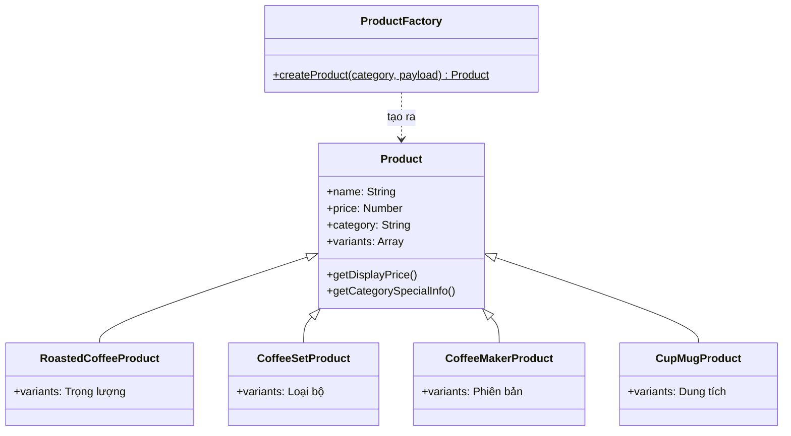
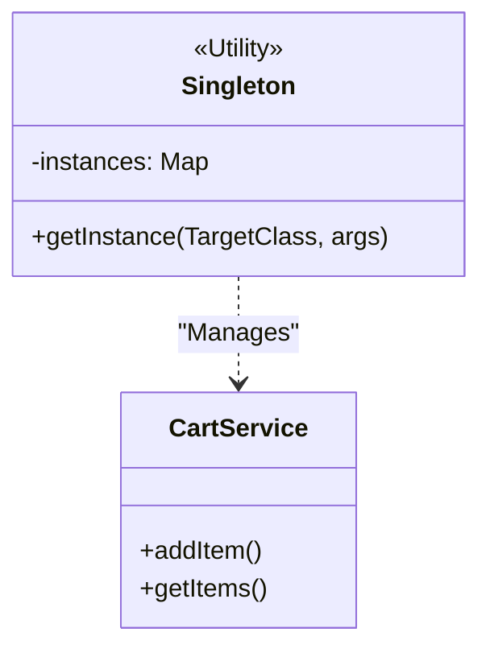
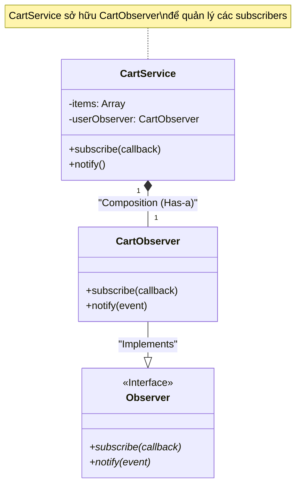
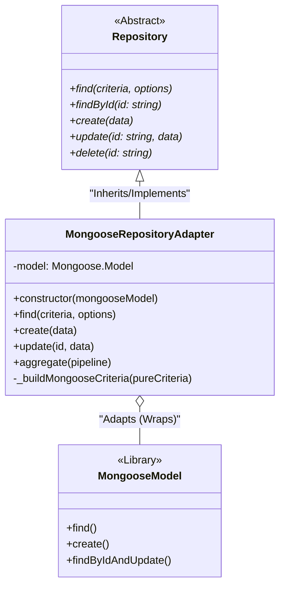
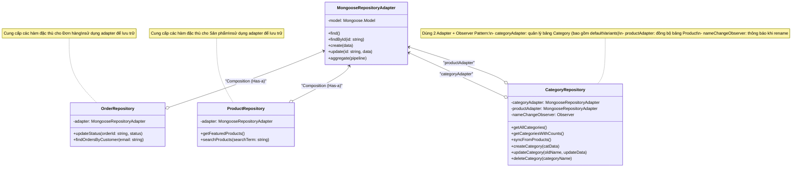
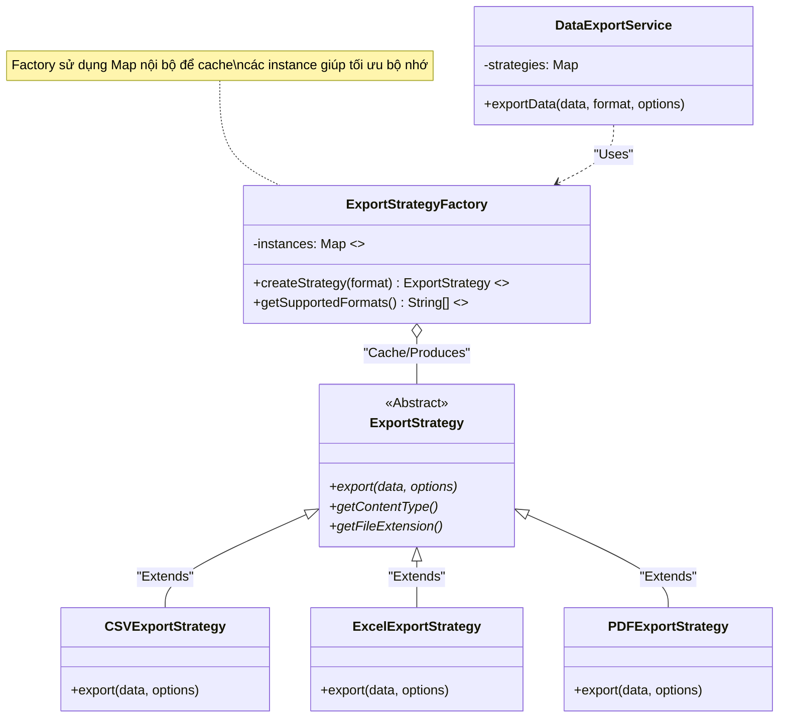
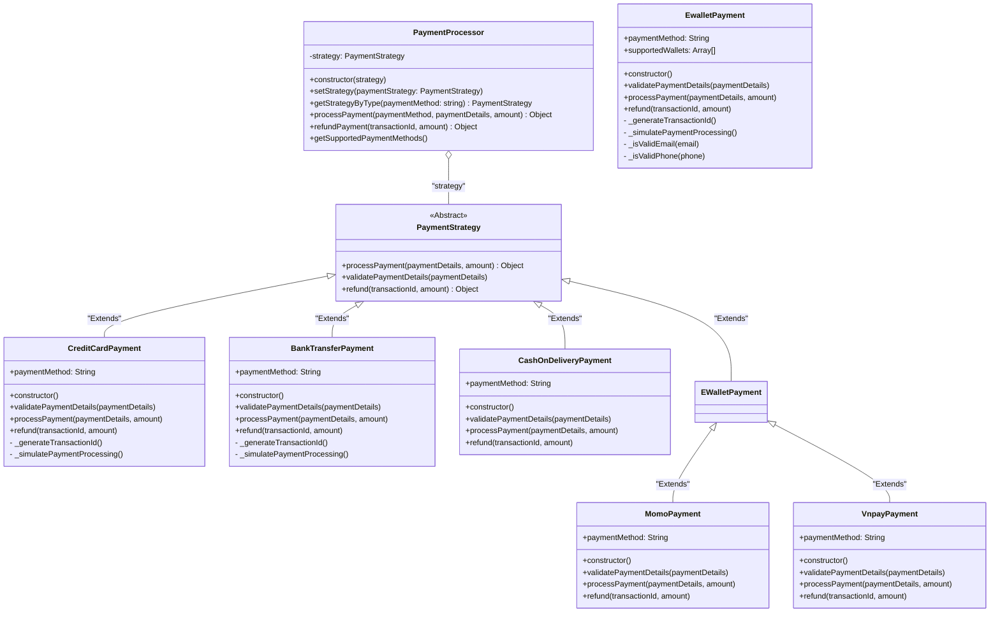

# Design Pattern Class Diagram Analysis Report (Final)

Tài liệu này cung cấp cái nhìn chi tiết về các mẫu thiết kế (Design Patterns) được áp dụng trong hệ thống Backend.

---

## 🏗️ 1. Factory Pattern (Mẫu Khởi Tạo)
**Mục đích:** Tạo các loại sản phẩm khác nhau với thuộc tính riêng.

### Sơ đồ lớp (Class Diagram)

### Giải thích
| Thành phần | Vai trò | Ví dụ |
|---|---|---|
| `ProductFactory` | Nhận tên category → trả về đúng loại Product | `createProduct("Roasted coffee")` → `RoastedCoffeeProduct` |
| `Product` | Lớp cha, chứa thuộc tính chung | name, price, variants... |
| `RoastedCoffeeProduct` | Cà phê rang — mặc định có tùy chọn **Trọng lượng** | 250g, 500g, 1kg |
| `CoffeeSetProduct` | Bộ quà tặng — mặc định có tùy chọn **Loại bộ** | Tiêu chuẩn, Cao cấp |
| `CoffeeMakerProduct` | Máy pha cà phê — mặc định có tùy chọn **Phiên bản** | Standard, Premium |
| `CupMugProduct` | Ly/Cốc — mặc định có tùy chọn **Dung tích** | 350ml, 500ml |

### 💡 Câu hỏi hội đồng:
*Hỏi: Tại sao dùng Factory?*
*Trả lời: Khi thêm loại sản phẩm mới, chỉ cần tạo Class mới kế thừa Product, không sửa code cũ (Open/Closed Principle).*

*Hỏi: Mỗi loại sản phẩm khác nhau chỗ nào?*
*Trả lời: Khác ở thuộc tính `variants` mặc định. Ví dụ cà phê rang có "Trọng lượng" (250g/500g/1kg), ly cốc có "Dung tích" (350ml/500ml).*

---

## 📦 2. Singleton Pattern (Mẫu Đơn Thế)
**Mục đích:** Đảm bảo một Class chỉ có duy nhất một thực thể và cung cấp một điểm truy cập toàn cục.
- **Classes**: `CartService`, `AppConfig`.
- **Cơ chế**: Sử dụng lớp tiện ích `Singleton.js` để quản lý việc khởi tạo và lưu trữ instance (`Singleton.getInstance(TargetClass)`). Điều này giúp tập trung hóa logic Singleton và tránh lặp lại mã nguồn.

### Sơ đồ lớp (Class Diagram)

---

## 🔔 3. Observer Pattern (Mẫu Người Quan Sát)
**Mục đích:** Thông báo thay đổi trạng thái thời gian thực.
- **Subject**: `Observer` (Base), `ReviewObserver` (Concrete).
- **Observer**: `WebSocketAdapter`.

## 🔔 3. Observer Pattern (Mẫu Người Quan Sát)
**Mục đích:** Xây dựng mối quan hệ phụ thuộc một-nhiều giữa các đối tượng để khi một đối tượng thay đổi trạng thái, tất cả các đối tượng phụ thuộc nó sẽ được thông báo.
- **Subject**: `CartService` (Chứa logic thông báo).
- **Observer**: `CartObserver`.
- **Cơ chế**: `CartService` sở hữu một `CartObserver` để thông báo cho các thành phần UI khi giỏ hàng thay đổi.

### Sơ đồ lớp (Class Diagram)

### 💡 Câu hỏi hội đồng:
*Hỏi: Tại sao CartService dùng quan hệ Composition với CartObserver?*
*Trả lời: Vì CartObserver là một thành phần thiết yếu của CartService để thực hiện chức năng thông báo. Khi CartService bị hủy, CartObserver cũng sẽ bị hủy theo. Điều này giúp đóng gói (encapsulate) toàn bộ logic thông báo thay đổi giỏ hàng vào một khối duy nhất.*

---

## 🔗 4. Adapter Pattern (Mẫu Bộ Chỉnh Lưu)
**Mục đích:** Kết nối các thành phần không cùng giao diện, giúp hệ thống không bị phụ thuộc vào thư viện bên thứ ba (Mongoose).
- **Target (Interface)**: `Repository` (Lớp trừu tượng định nghĩa các hàm lưu trữ thuần túy).
- **Adapter**: `MongooseRepositoryAdapter` (Lớp chuyển đổi từ lệnh Repository sang lệnh Mongoose).
- **Adaptee**: Mongoose.Model Library (Thư viện MongoDB).

### Sơ đồ lớp (Class Diagram)

### 💡 Câu hỏi hội đồng:
*Hỏi: Tại sao cần dùng Adapter thay vì gọi thẳng Model.find()?*
*Trả lời: Để đạt được sự độc lập về công nghệ. Nếu sau này chúng ta đổi từ MongoDB sang PostgreSQL, chúng ta chỉ cần viết thêm `SequelizeRepositoryAdapter` mà không cần sửa bất kỳ dòng code nào ở tầng Service hay Controller.*

### 💡 Câu hỏi hội đồng:
*Hỏi: Adapter Pattern giải quyết vấn đề gì ở đây?*
*Trả lời: Nó giúp "decouple" (tách biệt) mã nguồn khỏi Mongoose. Nếu sau này chúng ta đổi từ MongoDB sang SQL, chúng ta chỉ cần viết thêm một `SequelizeRepositoryAdapter` mà không cần phải sửa bất kỳ dòng code nào ở tầng nghiệp vụ (Service/Controller).*

---

## 🗄️ 5. Repository Pattern (Mẫu Kho Dữ Liệu)
**Mục đích:** Tách biệt hoàn toàn logic truy cập dữ liệu (Data Access) ra khỏi logic nghiệp vụ (Business Logic). 
- **Core Component**: `MongooseRepositoryAdapter` (Cung cấp các hàm CRUD cơ bản).
- **Concrete Repositories**: `OrderRepository`, `ProductRepository`, `CategoryRepository`, `AccountRepository`.
- **Cơ chế**: Sử dụng **Composition (Thành phần)** - Các Repository chứa một instance của Adapter để thực thi lệnh.

### Sơ đồ lớp (Class Diagram)

### 💡 Câu hỏi hội đồng:
*Hỏi: Sự khác biệt giữa Repository và Adapter ở đây là gì?*
*Trả lời: Adapter tập trung vào kỹ thuật (làm thế nào để nói chuyện với DB), còn Repository tập trung vào nghiệp vụ (lấy đơn hàng của ai, tìm sản phẩm theo tên). Repository sử dụng Adapter như một công cụ để thực hiện công việc lưu trữ mà không cần quan tâm DB là loại gì.*

### 💡 Câu hỏi hội đồng:
*Hỏi: Repository mang lại lợi ích gì cho việc bảo trì?*
*Trả lời: Giúp gom toàn bộ các câu truy vấn (Query) vào một nơi duy nhất. Thay vì rải rác các hàm như `Order.find()` ở khắp các Controller, chúng ta chỉ cần gọi `orderRepository.find()`. Điều này giúp kiểm soát dữ liệu đầu ra và dễ dàng tối ưu hóa truy vấn khi cần.*

---

## 📈 6. Strategy & Factory Pattern (Xuất Dữ Liệu)
**Mục đích:** Sự kết hợp giữa **Strategy** (để đóng gói các định dạng xuất file) và **Factory** (để khởi tạo đúng định dạng yêu cầu), giúp hệ thống linh hoạt và dễ mở rộng.

- **Context**: `DataExportService` (trong `backend/patterns/strategy/export/DataExportService.js`)
- **Factory**: `ExportStrategyFactory` (Sử dụng cơ chế **Caching/Flyweight** để tối ưu bộ nhớ).
- **Abstract Strategy**: `ExportStrategy`
- **Concrete Strategies**: `CSVExportStrategy`, `ExcelExportStrategy`, `PDFExportStrategy`.

### Sơ đồ lớp (Class Diagram)

### 💡 Câu hỏi hội đồng:
*Hỏi: Tại sao lại áp dụng Caching trong Factory ở đây?*
*Trả lời: Vì các lớp Strategy (CSV, Excel, PDF) là stateless (không lưu trạng thái riêng tư giữa các lần gọi), chúng ta không cần khởi tạo lại đối tượng mỗi lần. Áp dụng Caching (tương tự **Flyweight Pattern**) giúp giảm việc cấp phát bộ nhớ và giảm tải cho Garbage Collector, giúp hệ thống chạy nhanh hơn khi có nhiều yêu cầu xuất dữ liệu cùng lúc.*

*Hỏi: Vai trò của Factory trong mô hình Strategy này là gì?*
*Trả lời: Factory chịu trách nhiệm logic khởi tạo (Creation Logic). Nó giúp "giấu" logic chọn lựa Strategy, làm cho Code ở Service tập trung hoàn toàn vào nghiệp vụ xuất dữ liệu.*

---

## 💳 7. Strategy Pattern (Mẫu Chiến Lược - Thanh toán)
**Mục đích:** Đóng gói các thuật toán thanh toán khác nhau và cho phép thay đổi linh hoạt tại thời điểm chạy.
- **Context**: `PaymentProcessor`
- **Strategies**: `CreditCardPayment`, `MomoPayment`, `VnpayPayment`, `BankTransferPayment`, `CashOnDeliveryPayment`.

### Sơ đồ lớp (Class Diagram)

### Phân tích chuyên sâu (Phiên bản đồng bộ mã nguồn)
*   **Dynamic Selection**: `PaymentProcessor` sử dụng phương thức `getStrategyByType()` để tự động tạo và gán chiến lược thanh toán phù hợp khi người dùng nhấn nút đặt hàng. 
*   **Encapsulation**: Mỗi lớp `ConcreteStrategy` (như `MomoPayment`) tự đóng gói logic mô phỏng QR Code hoặc xử lý mã thẻ riêng biệt mà không làm phình to Controller chính.
*   **Mock Verification**: Phần `validatePaymentDetails` trong các lớp thẻ và chuyển khoản đã được gỡ bỏ logic bắt buộc để tối ưu trải nghiệm Demo, giúp luồng đi từ Checkout đến Success không tốn thời gian nhập liệu giả.

### 💡 Câu hỏi hội đồng:
*Hỏi: Tại sao thanh toán cần dùng Strategy mà không dùng If-else?*
*Trả lời: Dùng Strategy giúp tách biệt logic xử lý của từng nhà cung cấp (Momo, VNPAY, Bank...). Khi một nhà cung cấp thay đổi API hoặc ta muốn thêm ví điện tử mới, ta chỉ cần tạo Class mới mà không làm hỏng code hiện tại (Open/Closed Principle).*

---
*Generated for: Design_Patterns_Final Academic Defense*
